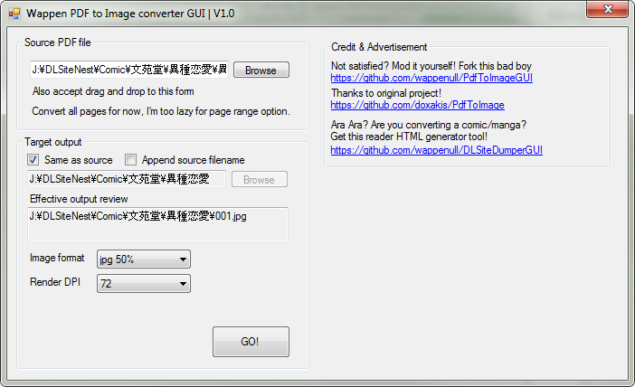

# PdfToImage C# GUI
* Convert PDF To jpg/png in c# (using PdfiumViewer).
* Now with over-engineered GUI!
* No option for page range for now, I'm too lazy.

# [Download EXE Now v1.1](https://github.com/wappenull/PdfToImageGUI/releases/download/v1.1/PdfToImageGUI_v1.1.zip)
It is using .NET framework 4.7.2 Get the runtime if you dont have it yet:
https://dotnet.microsoft.com/download/dotnet-framework/net472
